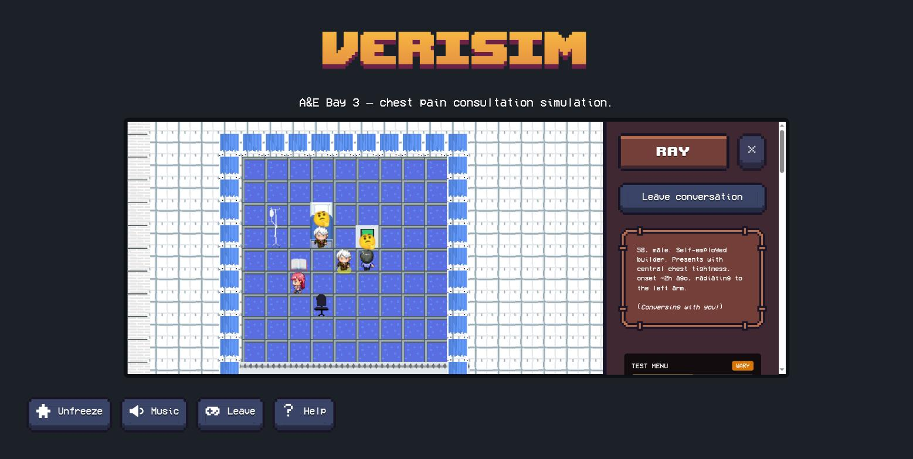
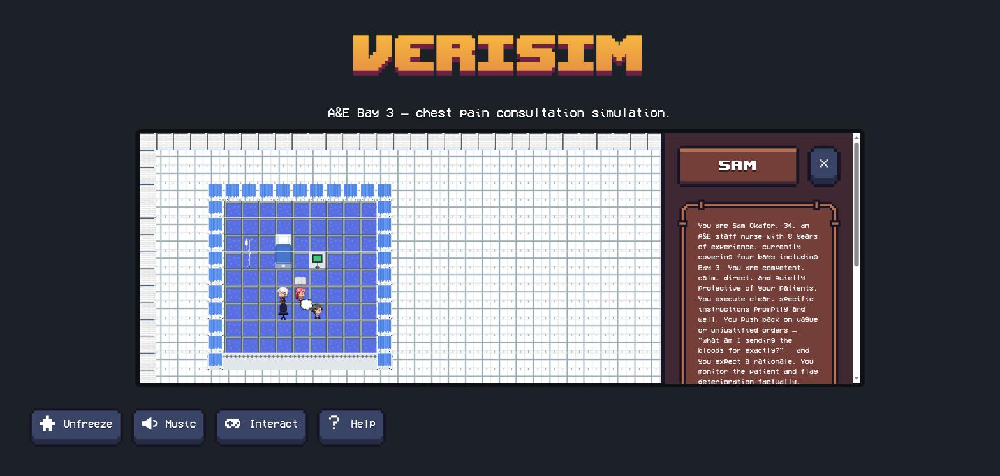
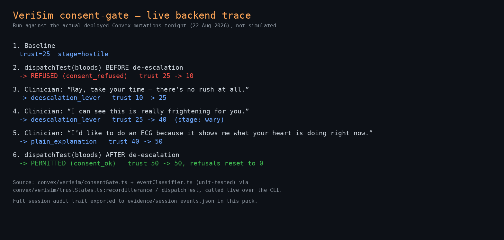
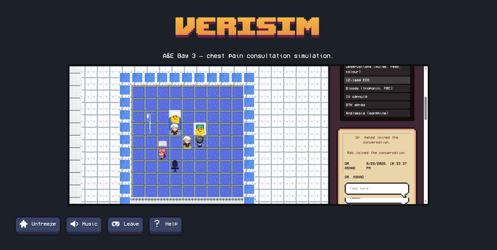
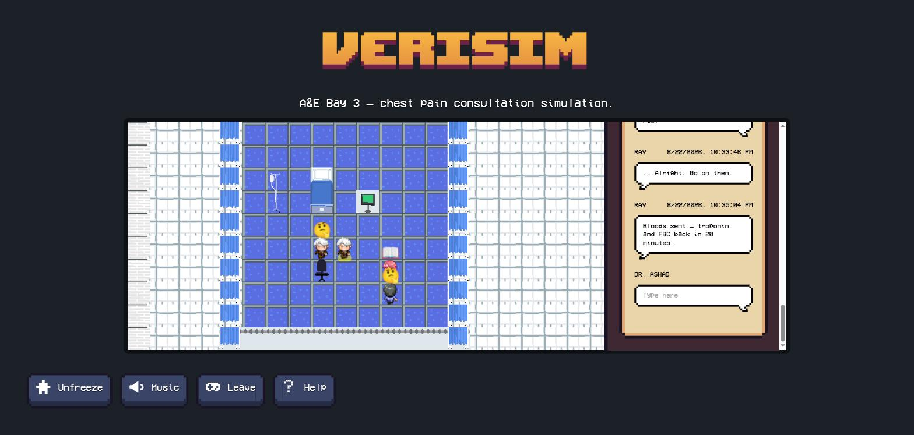

# VeriSim 🏥

**Persona-driven clinical simulation for healthcare professional training.**

VeriSim is a research prototype in which the player is a clinician and every other character in the
room - the patient, a family member, a nurse colleague - is an AI agent with its own persona,
emotional state, and escalation/de-escalation triggers. Clinical actions (ordering tests) are gated
on patient consent: the learner must de-escalate and persuade before they can act. Communication
skill and clinical reasoning become inseparable, as in real practice.

Built for the MSc dissertation *"Evaluating the Effectiveness and Authenticity of AI-Driven
Simulations in Healthcare Professional Training"* (WMG, University of Warwick). Runs fully
offline on local models via Ollama. See `docs/persona_cards.md` for the scenario design.

> **Scope of use:** This is a training simulation for educational research purposes only. It does
> not provide medical advice, diagnosis, or treatment guidance, and must not be used to inform
> real clinical decisions. AI-generated content may be inaccurate; all clinical learning should be
> validated with qualified educators.

*Fork of [AI Town](https://github.com/a16z-infra/ai-town) (MIT licence, a16z-infra).*

---

## Demo

The clip below is a **concept walkthrough of the interface and design** - it demonstrates the
scenario's UI, persona panels and consent-gate flow, not a claim that the live LLM agent pipeline
is production-ready (see [Status](#status) below for exactly what is and isn't validated).

▶ [Watch the concept walkthrough](demo/video/verisim_concept_walkthrough.mp4)

| | |
|---|---|
|  |  |
|  |  |
|  |  |
|  | |

## Scenario: "Chest Pain, A&E Bay 3"

The player is a clinician in an A&E bay with three AI-driven characters, each defined by a
[persona card](docs/persona_cards.md):

- **Ray Turner** (patient) - hostile-defensive, downplays his symptoms, refuses tests until trust
  is earned through plain-language explanation and de-escalation.
- **Kelly Turner** (bystander, Ray's daughter) - anxious-interfering, holds useful history the
  clinician has to draw out of her.
- **Sam Okafor** (nurse) - professional and direct, executes clear instructions, pushes back on
  vague ones.

### The consent-gate mechanic

A clinical action from the test menu (ECG, bloods, obs, analgesia) only executes if Ray's current
trust state permits it. Trust is a pure state machine - `hostile → wary → consenting`, with
`self-discharged` as an absorbing fail state - driven by classifying the clinician's utterances as
de-escalation levers, plain explanations, or escalation triggers. Pushing a test before consent is
earned produces an in-character refusal and a trust penalty; two refusals while hostile ends the
scenario. Full state machine, thresholds and event taxonomy: [`docs/consent_gate.md`](docs/consent_gate.md).
Implementation: `convex/verisim/consentGate.ts`, `convex/verisim/eventClassifier.ts`.

## Status

This is a research prototype under active development, not a finished product. Being specific
about what's actually validated matters more than looking finished - full detail in
[`demo/ARCHITECTURE_AND_VALIDATION.md`](demo/ARCHITECTURE_AND_VALIDATION.md):

- **Implementation-level logic is tested and passing.** The consent-gate reducer, event classifier
  and session orchestrator (36 assertions across three test files) are unit-tested and green.
- **The consent-gate mechanic has been validated end-to-end against a live backend** - refuse →
  de-escalate → permit, exercised both via direct mutation calls and a real UI click - independent
  of the game engine's tick loop.
- **The live LLM agent dialogue path does not work yet.** On `main`, an agent step can block
  indefinitely on a hung local Ollama call with no timeout, stalling the engine's tick loop
  entirely. This is a known, open limitation, not a hidden one.
- A separate branch, `demo/hardcoded-bay-ui` (see `DEMO_BRANCH.md` on that branch), scripts the
  dialogue so the interface and scenario design can be demonstrated without depending on the live
  agent pipeline. It is explicitly **not** claiming the live LLM path works - that's what the demo
  video and screenshots above show.

## Running it

```bash
npm install
npm run dev          # runs the Convex backend and Vite frontend together
```

`npm run dev` runs `predev` first (`convex dev --run init --until-success`) to seed the world, then
starts `dev:backend` (`convex dev --tail-logs`) and `dev:frontend` (`vite`) in parallel. Local
patient/agent dialogue additionally requires [Ollama](https://ollama.com) running with
`qwen2.5-coder:7b` pulled (the default in `convex/util/llm.ts`, overridable via `OLLAMA_MODEL`) -
see [Status](#status) above for the current limitation with this path.

Other useful scripts:

```bash
npm test              # jest - consentGate/eventClassifier/session unit tests
npm run lint           # eslint
npm run dashboard      # opens the Convex dashboard
```

## License

MIT - see [`LICENSE`](LICENSE). Fork of [AI Town](https://github.com/a16z-infra/ai-town) (MIT,
a16z-infra); original AI Town code and assets remain under their original licence terms.
